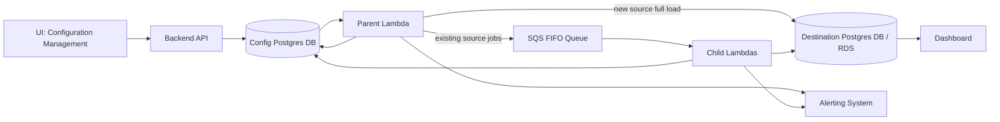
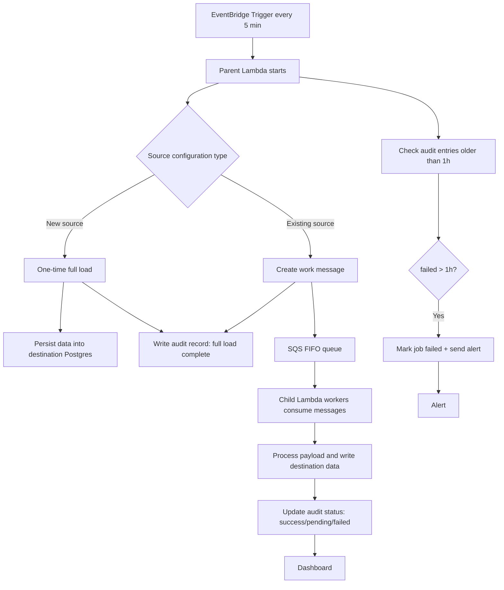

# NRT — Near Real-Time Data Ingestion Pipeline

## Overview
This project implements a near-real-time data ingestion pipeline with end-to-end configuration, audit, and delivery into a PostgreSQL destination. The system is designed to process source configuration records every 5 minutes, manage a one-time full load for new sources, and continuously stream updates through an autoscaling child lambda fleet.

Key characteristics:
- Near real time: latency target < 5 minutes
- Config-driven ingestion via UI and API
- Postgres-based configuration store + audit tracking
- AWS EventBridge-scheduled parent Lambda
- SQS FIFO message queue for ordered, reliable processing
- Autoscaling child Lambda workers with concurrency control
- Failure handling, alerting, and dashboard-ready destination data

## System Components

1. UI
- Users define and manage source configurations.
- The UI sends configuration data to backend APIs.

2. Backend API
- Receives configuration changes and persists them into PostgreSQL.
- Stores source metadata and sync state in a `source_configurations` table.
- Maintains audit records in an `audit_log` table.

3. Postgres databases
- `config_db`: stores everything related to source configuration and pipelines.
  - `source_configurations`: source metadata, last sync time, load status, type, and destination mapping.
  - `audit_log`: processing status, message metadata, timestamps, error counts, and alert flags.
- `destination_db`: stores final ingested data for analytics and reporting.
  - Destination tables are exposed via RDS for dashboards.

4. AWS EventBridge Rule
- Triggers the parent Lambda every 5 minutes.
- Ensures the pipeline runs on a predictable near-real-time cadence.

5. Parent Lambda
- Reads active source configurations from Postgres.
- For new sources, triggers a one-time full load into destination Postgres.
- For existing sources, publishes work items to an SQS FIFO queue.
- Writes audit entries for every queued job and load operation.
- Detects stuck or failed messages older than 1 hour and escalates alerts.

6. SQS FIFO Queue
- Ensures ordered, duplicate-safe message delivery.
- Carries change processing requests from the parent Lambda to child Lambdas.

7. Child Lambda Workers
- Auto-scale up to a configured concurrency limit (e.g. max 10 lambdas).
- Consume audit entries and process queued messages.
- Update audit status to `pending`, `success`, or `failed`.
- Persist transformed data into the destination Postgres table.

8. Dashboard / Reporting
- Final destination Postgres is exposed via RDS.
- Dashboards build analytics over the ingested data for business users.

## Architecture Diagram

> If your Markdown viewer does not render Mermaid diagrams, use the plain-text architecture below.

### Plain-text architecture diagram

UI
  |
  v
Backend API
  |
  v
Config Postgres DB (config_db)
  |-- stores source_configurations
  |-- stores audit_log
  |
  v
Parent Lambda
  |-- if new source --> one-time full load --> Destination Postgres DB (destination_db)
  |-- if existing source --> send message --> SQS FIFO

SQS FIFO
  |
  v
Child Lambda workers
  |-- read audit state from Config Postgres DB
  |-- process work messages
  |-- write results to Destination Postgres DB

Destination Postgres DB --> Dashboard / reporting

Parent Lambda also scans Config Postgres DB for stuck audit entries and triggers alerts

## Flowchart

> Note: Mermaid diagrams require Markdown preview support that renders diagrams. If your viewer does not render Mermaid, use the plain-text flow below.

### Plain-text flowchart

1. EventBridge triggers every 5 minutes.
2. Parent Lambda starts.
3. Parent Lambda evaluates each source configuration:
   - New source:
     * One-time full load is started.
     * Source data is persisted into the destination Postgres table.
     * An audit record is written for the full-load completion.
   - Existing source:
     * A work message is created.
     * The message is sent to the SQS FIFO queue.
     * An audit record is written for the queued job.
4. Child Lambda workers consume messages from SQS FIFO.
   - They process the payload.
   - They write transformed results into destination Postgres.
   - They update audit status to `success`, `pending`, or `failed`.
5. Parent Lambda also checks the audit table for entries older than 1 hour.
   - If an item has been failing for more than 1 hour, it is marked as failed and an alert is triggered.
6. The destination Postgres data is exposed to the dashboard for reporting.

## Detailed Data Flow

1. User creates or updates source configuration in the UI.
2. Backend API validates and persists configuration into Postgres.
3. Every 5 minutes, EventBridge triggers the parent Lambda.
4. Parent Lambda retrieves all active source configurations.
5. If a source is newly configured:
   - Parent invokes a one-time full load job.
   - Entire source data is extracted and loaded into the destination Postgres table.
   - Parent logs the load completion in the audit table.
6. If a source is already configured:
   - Parent generates incremental work messages.
   - Messages are sent to SQS FIFO and audit entries are created.
7. Child Lambdas poll SQS, read corresponding audit entries, and process the messages.
8. Child workers update the audit entry status and write results to destination Postgres.
9. Parent Lambda also scans the audit table for expired or stuck messages.
10. If a job stays failed/pending for more than 1 hour, the system marks it failed and triggers alerts.
11. Dashboard queries the destination Postgres data for visualization.